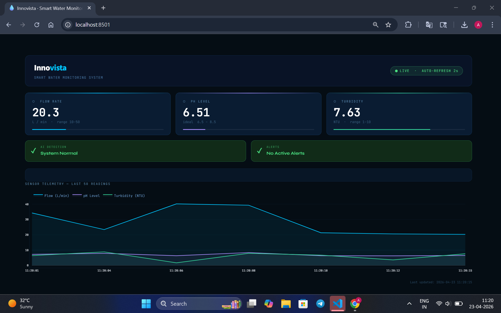

# 💧 Innovista — Smart Water Monitoring System

🚀 *AI-powered water conservation and monitoring platform*

---

## 📌 Overview

Innovista is a smart water management system that simulates real-time monitoring, detects anomalies using AI, and provides actionable insights to reduce water wastage.

This project demonstrates how IoT + AI can be combined to build scalable solutions for water conservation — even in a prototype environment without physical sensors.

---

## 🎯 Key Features

* 📡 Real-time data simulation (Flow rate, pH, Turbidity)
* 🧠 AI-based anomaly detection (Isolation Forest)
* 🚨 Leak detection alerts
* 📊 Interactive live dashboard (Streamlit)
* 🔄 Auto-refresh monitoring system
* 🌍 Scalable architecture for IoT integration

---

## 📸 Dashboard Preview

<p align="center">
  
</p>

---

## 🧠 Tech Stack

| Category         | Technology Used |
| ---------------- | --------------- |
| Language         | Python          |
| Frontend         | Streamlit       |
| Data Handling    | Pandas, NumPy   |
| Machine Learning | Scikit-learn    |
| Version Control  | Git & GitHub    |

---

## ⚙️ Installation & Setup

### 1️⃣ Clone Repository

```bash
git clone https://github.com/YOUR_USERNAME/Innovista-Water-Monitoring.git
cd Innovista-Water-Monitoring
```

### 2️⃣ Install Dependencies

```bash
pip install -r requirements.txt
```

### 3️⃣ Run Application

```bash
python -m streamlit run app.py
```

---

## 🧪 How It Works

1. Simulated sensors generate water data (flow, pH, turbidity)
2. Data is stored and visualized in real-time
3. Machine learning model detects anomalies
4. Alerts are triggered for:

   * 🚨 Leak detection (high flow)
   * ⚠️ Unsafe pH levels
   * 🔍 AI-based anomalies
5. Dashboard updates continuously to reflect live conditions

---

## 📊 Use Cases

* 🏭 Industrial water monitoring
* 🌾 Smart agriculture irrigation
* 🏙️ Urban water distribution systems
* 🏫 Educational/demo AI-IoT projects

---

## 🔮 Future Scope

* 📡 Integration with real IoT sensors (ESP32, Arduino)
* ☁️ Cloud deployment (AWS / Firebase)
* 📱 Mobile notifications (SMS/Push alerts)
* 🤖 Predictive analytics for water usage
* 🗺️ Geo-based water monitoring system

---

## 👨‍💻 Team Innovista

* **Neeraj N** — Hardware & System Architecture
* **Arnold** — Data Science & AI Development

---

## 🌍 Vision

> "To build intelligent systems that ensure sustainable and efficient use of water resources for a better future."

